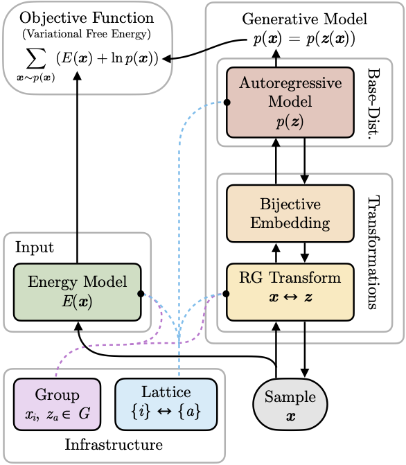

# Holographic Pixel-GNN

*Warning: Project under development. Nothing is stable at this moment.*

## Goal

Generative models have been applied to solve Statistical Mechanics problems by learning to model the Boltzmann distribution of microscopic configurations given the energy functional. This project aims to explore the combination of both **flow-based** and **autoregressive** models together with ideas from **renormalization group** and **holography** to tackle **critical** (scale-free) spin systems.

## Architecture Overview
The model consists of the following parts:

* A generative model p(x) consist of
  * A base model p(z) realized as an **autoregressive model**, which uses **graph neural network** (GNN) techniques to compute conditional distributions on a directed causal graph.
  * A stack of transformations containing
     * A **bijective encoding** (beetween one-hot and categorical)
     * A **renormalization group (RG) transformation** realized as a flow model (but currently fixed to be Haar wavelet transformation in this project).
* An **energy model** E(x) must be provided as input to drive the training.
* All these modules are based on information provided by the infrastructure layer which contains:
  * A **group model** to provide basic functions of group operation and group function evaluation.
  * A **lattice model** to provide indexing of nodes and to construct the causal graph in the holographic bulk.
  
Finally, the model is trained to minize the variational free energy.
